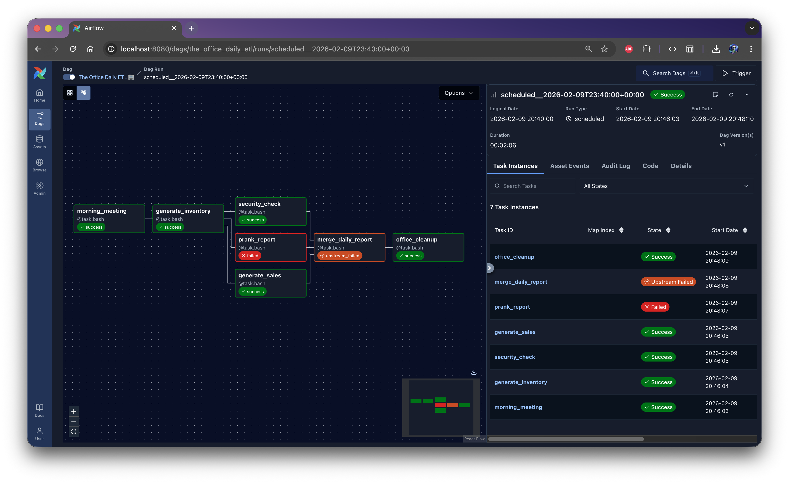

# Airflow


This repository provides an experimental environment for studying Apache Airflow and its core orchestration concepts.

It contains intentionally simple DAGs, primarily using basic operators, designed to isolate and analyze Airflow’s behavior, including task dependencies, execution order, parallelism, retries, failure handling, and trigger rules.

The project prioritizes clarity and observability over production realism, serving as a focused learning and experimentation reference.

## Quick Start

Let's start the Airflow 🚀

```bash
# Start 🟢
cd docker && docker-compose up -d

# Access the Container 👨‍💻
docker compose exec airflow bash

# Turn Off 🔴
docker-compose down
```

> [!TIP]
> Airflow will be running at `http://localhost:8080` 🌎



## Appendix

### Dev Setup

<details>
<summary>Python Virtual Environment Setup</summary>

This will help you develop the Airflow DAGs.

```bash
# 👇 Setting PyEnv version
pyenv local 3.13.2

# 👇 Virtual Environment
python -m venv .venv \
  && source .venv/bin/activate \
  && pip install --upgrade pip

# 👇 Dependencies
pip install -r requirements-dev.txt
```

</details>

### Using Local Operator

In this example I'm not using an external database, therefore the `SQLite` is the default option.

Here's an example on how to configure an external database in this project...

<details>
<summary>Configuring PostgreSQL</summary>

```yml
# docker-compose.yml
services:
    database:
        container_name: postgres
        image: postgres
        environment:
            POSTGRES_USER: admin
            POSTGRES_PASSWORD: pass4admin
            POSTGRES_DB: airflow
    airflow:
        # Add the follwing fields to the existing configuration
        depends_on:
            - database
        environment:
            AIRFLOW__DATABASE__SQL_ALCHEMY_CONN: "postgresql+psycopg2://admin:pass4admin@db:5432/airflow"
```

</details>

### Related Links

- [Core Concepts](https://airflow.apache.org/docs/apache-airflow/stable/core-concepts/index.html)
  - [Executors](https://airflow.apache.org/docs/apache-airflow/stable/core-concepts/executor/index.html#)
  - [Operators](https://airflow.apache.org/docs/apache-airflow/stable/core-concepts/operators.html)
    - [Astronomer - What is an Operator?](https://www.astronomer.io/docs/learn/what-is-an-operator)
    - [Some Operators](https://airflow.apache.org/docs/apache-airflow/stable/howto/operator/index.html)
- Upgrading from **v2 ➡ v3**
  - [v3 Announcements](https://airflow.apache.org/blog/airflow-three-point-oh-is-here)
  - [Architectural Differences](https://airflow.apache.org/docs/apache-airflow/stable/installation/upgrading_to_airflow3.html)  
    _A key change in this repo: the Sequential Executor was replaced by the LocalExecutor,  
    which can still be used with SQLite for local development._
